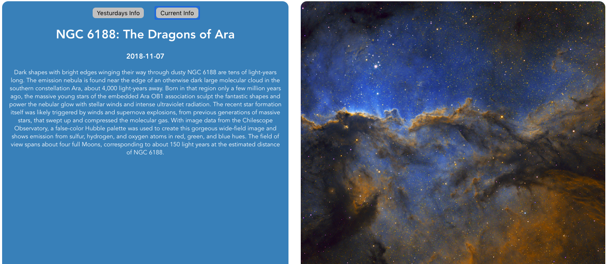

# Final Countdown

## About
This project was designed as a challenge to learn how to build a simple app with a JavaScript framework that I've never used. The framework used to create this application was Vue.js. The information displayed was gathered from the NASA api. The challenge was conducted over two days.

## Sample Of Project


## Project setup
```
npm install
```

### Compiles and hot-reloads for development
```
npm run serve
```

### Run your tests
```
npm run test
```

### Lints and fixes files
```
npm run lint
```
